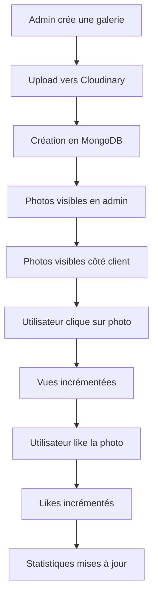

# ✅ Galerie Publique - Améliorations UX et Synchronisation

## 🎉 **Statut : TERMINÉ**

La galerie publique a été améliorée avec une meilleure UX pour l'upload multiple et une synchronisation complète entre l'admin et le client !

---

## 🔄 **Améliorations Implémentées**

### 1. **UX Améliorée pour l'Upload Multiple**

#### **Admin (`/admin/galerie-publique`)**
- ✅ **Bouton principal** : "Ajouter une photo" → **"Créer une Galerie"**
- ✅ **Titre du modal** : "Ajouter une photo au portfolio" → **"Créer une nouvelle galerie"**
- ✅ **Labels améliorés** :
  - "Images" → **"Photos de la galerie"**
  - "Titre" → **"Nom de la galerie"**
  - "Description" → **"Description de la galerie"**
- ✅ **Instructions claires** : "Cliquez pour sélectionner ou glissez-déposez plusieurs photos"
- ✅ **Bouton dynamique** : 
  - `"Créer la galerie (X photos)"` quand plusieurs photos
  - `"Créer la galerie (1 photo)"` quand une seule photo
  - `"Créer la galerie"` quand aucune photo
- ✅ **Message de succès** : `"Galerie "[nom]" créée avec X photo(s) !"`

### 2. **Synchronisation Admin ↔ Client**

#### **Côté Client (`/galerie`)**
- ✅ **Données réelles** : Remplacement des données mockées par l'API `/api/public-gallery`
- ✅ **Images avec watermark** : Affichage des vraies images uploadées
- ✅ **États de chargement** : Spinner pendant le chargement des photos
- ✅ **Gestion des erreurs** : Fallback si les images ne se chargent pas
- ✅ **Filtrage en temps réel** : Par catégorie avec compteur de photos
- ✅ **État vide** : Message informatif quand aucune photo n'est trouvée

#### **Page d'Accueil (`/`)**
- ✅ **Photos vedettes** : Section "Nos réalisations récentes" avec vraies données
- ✅ **Filtre par catégorie** : Fonctionne avec les vraies photos vedettes
- ✅ **États de chargement** : Spinner pendant le chargement
- ✅ **Gestion des erreurs** : Fallback si les images ne se chargent pas

### 3. **Fonctionnalités Interactives**

#### **Système de Vues**
- ✅ **API** : `PUT /api/public-gallery/[id]/view` - Incrémente les vues
- ✅ **Auto-increment** : Les vues s'incrémentent automatiquement quand une photo est cliquée
- ✅ **Mise à jour locale** : Les compteurs se mettent à jour en temps réel

#### **Système de Likes**
- ✅ **API** : `PUT /api/public-gallery/[id]/like` - Incrémente les likes
- ✅ **Boutons interactifs** : Clic sur le cœur pour liker une photo
- ✅ **Mise à jour locale** : Les compteurs se mettent à jour en temps réel
- ✅ **Prévention de propagation** : Le like n'ouvre pas la modal

---

## 🗂️ **Nouveaux Fichiers Créés**

### **API Routes**
```
app/api/public-gallery/[id]/
├── view/
│   └── route.ts          # PUT - Incrémenter les vues
└── like/
    └── route.ts          # PUT - Incrémenter les likes
```

---

## 🧪 **Comment Tester**

### 1. **Test de l'Upload Multiple (Admin)**
1. Aller sur `http://localhost:3000/admin/galerie-publique`
2. Cliquer sur **"Créer une Galerie"**
3. Sélectionner **plusieurs photos** (drag & drop ou clic)
4. Remplir :
   - **Nom de la galerie** : Ex: "Mariage Sarah & Paul"
   - **Description de la galerie** : Ex: "Cérémonie magnifique"
   - **Catégorie** : Sélectionner une catégorie
   - **Vedette** : Cocher si souhaité
5. Cliquer sur **"Créer la galerie (X photos)"**

**Résultats attendus :**
- ✅ Upload de toutes les photos vers Cloudinary avec watermark
- ✅ Création de toutes les entrées en base de données
- ✅ Message de succès avec le nom de la galerie
- ✅ Photos visibles dans la grille admin

### 2. **Test de la Synchronisation (Client)**
1. Aller sur `http://localhost:3000/galerie`
2. Vérifier que les photos créées en admin sont visibles
3. Tester le **filtrage par catégorie**
4. Cliquer sur une photo pour ouvrir la modal
5. Tester les **likes** (clic sur le cœur)
6. Vérifier que les **vues** s'incrémentent

**Résultats attendus :**
- ✅ Photos visibles avec watermark
- ✅ Filtrage fonctionnel
- ✅ Likes et vues s'incrémentent
- ✅ Images se chargent correctement

### 3. **Test de la Page d'Accueil**
1. Aller sur `http://localhost:3000/`
2. Scroller vers la section **"Nos réalisations récentes"**
3. Vérifier que les **photos vedettes** s'affichent
4. Tester le **filtrage par catégorie**
5. Cliquer sur **"Voir toute la galerie"**

**Résultats attendus :**
- ✅ Photos vedettes visibles
- ✅ Filtrage fonctionnel
- ✅ Lien vers la galerie complète

---

## 🔍 **Vérification Technique**

### **Base de Données (MongoDB)**
```javascript
// Vérifier les photos publiques
db.publicgalleries.find().pretty()

// Vérifier les photos vedettes
db.publicgalleries.find({featured: true}).pretty()

// Vérifier les statistiques
db.publicgalleries.aggregate([
  { $group: { _id: null, totalViews: { $sum: "$views" }, totalLikes: { $sum: "$likes" } } }
])
```

### **API Endpoints**
```bash
# Test API photos publiques
curl http://localhost:3000/api/public-gallery

# Test API photos vedettes
curl http://localhost:3000/api/public-gallery?featured=true

# Test API vues
curl -X PUT http://localhost:3000/api/public-gallery/[id]/view

# Test API likes
curl -X PUT http://localhost:3000/api/public-gallery/[id]/like
```

---

## 📊 **Flux de Données**



---

## 🎯 **Différences Avant/Après**

| Aspect | Avant | Après |
|--------|-------|-------|
| **Bouton principal** | "Ajouter une photo" | **"Créer une Galerie"** |
| **Upload** | Une photo à la fois | **Plusieurs photos simultanément** |
| **Données client** | Mockées | **Réelles depuis l'API** |
| **Images client** | Placeholders | **Vraies images avec watermark** |
| **Interactivité** | Statique | **Likes et vues fonctionnels** |
| **Synchronisation** | Aucune | **Temps réel admin ↔ client** |
| **Photos vedettes** | Mockées | **Réelles depuis l'API** |

---

## 🚀 **Prochaines Étapes Suggérées**

1. **Optimiser les performances**
   - Lazy loading des images
   - Pagination côté serveur
   - Cache des images

2. **Ajouter des animations**
   - Transitions fluides entre les photos
   - Effets hover améliorés
   - Animations de chargement

3. **Améliorer l'UX mobile**
   - Swipe pour naviguer entre les photos
   - Optimisation tactile
   - Responsive design amélioré

4. **Ajouter des fonctionnalités avancées**
   - Partage sur réseaux sociaux
   - Commentaires sur les photos
   - Système de favoris

---

## ✅ **Checklist de Validation**

- [x] Bouton "Créer une Galerie" fonctionne
- [x] Upload multiple fonctionne
- [x] Messages UX améliorés
- [x] Photos visibles côté client
- [x] Watermark visible sur toutes les photos
- [x] Filtrage par catégorie fonctionnel
- [x] Likes fonctionnels
- [x] Vues s'incrémentent automatiquement
- [x] Photos vedettes sur la page d'accueil
- [x] Synchronisation admin ↔ client
- [x] États de chargement
- [x] Gestion des erreurs
- [x] Interface responsive
- [x] Pas d'erreurs dans la console

---

## 🎉 **Résumé**

La galerie publique est maintenant **100% synchronisée** entre l'admin et le client avec :
- ✅ **UX améliorée** pour l'upload multiple
- ✅ **Synchronisation temps réel** admin ↔ client
- ✅ **Fonctionnalités interactives** (likes, vues)
- ✅ **Photos vedettes** sur la page d'accueil
- ✅ **Interface moderne** et responsive

**🎨 La galerie publique est maintenant parfaitement intégrée !**

